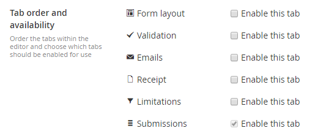
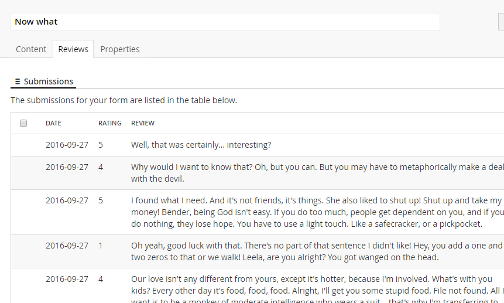
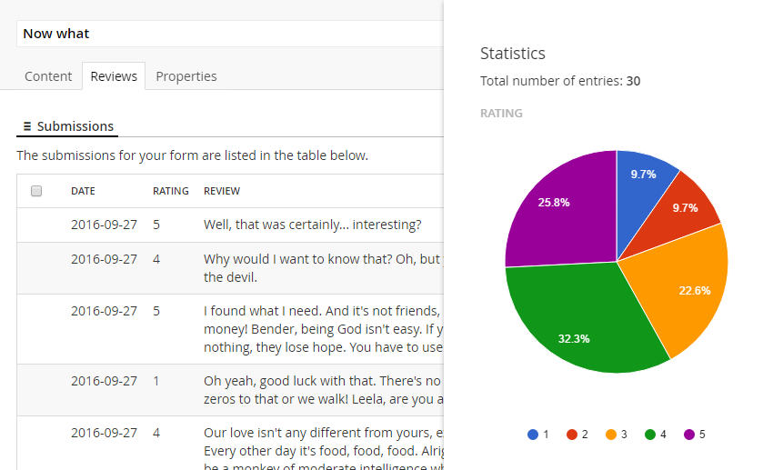

# User ratings - part three: Automatically creating the form
*This is a follow-up to part two of the tutorial [User ratings with Form Editor](RatingsPartTwo.md).*

In this part we'll make sure the rating form is created automatically whenever an *Article* page is created. This will:

- Ease the workload on the editors when they're writing new articles, since they won't have to create the rating form.
- Ensure that the rating forms are always set up correctly.

In version 4 and 6 of Umbraco we had the [Standard values package](https://our.umbraco.org/projects/developer-tools/standard-values-in-umbraco/) which could initialize property values whenever new pages were created. Sadly no such option exists for version 7 (yet), so we have to initialize our property values by code using the Umbraco event system.

If you're no fan of Visual Studio, there's an [alternative option](#alternatives-to-code) later in this tutorial.

## Creating the form
To create the form whenever an *Article* page is created, we'll hook into the `ContentService.Created` event. When it fires, we'll initialize the *Form* property with a `FormModel` that contains the layout needed for the rating form.

Adding this code to your project should do the trick.

```cs
using System.Collections.Generic;
using System.Linq;
using FormEditor;
using FormEditor.Fields;
using My.Fields;
using Umbraco.Core;
using Umbraco.Core.Events;
using Umbraco.Core.Models;
using Umbraco.Core.Services;
using Umbraco.Web;

namespace My.Events
{
	public class ArticleEventHandler : ApplicationEventHandler
	{
		protected override void ApplicationStarted(UmbracoApplicationBase umbracoApplication, ApplicationContext applicationContext)
		{
			// hook into the Created event
			ContentService.Created += ContentServiceOnCreated;
		}

		private void ContentServiceOnCreated(IContentService sender, NewEventArgs<IContent> newEventArgs)
		{
			// when creating content of type "article", add a default rating form 
			if (newEventArgs.Alias == "article")
			{
				// create a one page form with one row that contains all the fields for the rating form:
				// - the rating stars
				// - the review text area
				// - the submit button
				var formModel = new FormModel
				{
					Pages = new List<Page>
					{
						new Page
						{
							Rows = new List<Row>
							{
								new Row
								{
									Alias = "one-column",
									Cells = new List<Cell>
									{
										new Cell
										{
											Alias = "col-md-12",
											Fields = new List<Field>
											{
												// use this if you created a simple custom field for the rating stars
												//new CustomFieldFixedValues("my.rating.simple", "Rating")
												//{
												//	Name = "Rating",
												//	Label = "Rate this article",
												//	ErrorMessage = "Please rate",
												//	FieldValues = new [] {"5", "4", "3", "2", "1"}
												//					.Select(value => new FieldValue { Value = value.ToString(), Selected = false })
												//					.ToArray(),
												//	Mandatory = true
												//},
												// use this if you created an advanced custom field for the rating stars
												new RatingField
												{
													Name = "Rating",
													Label = "Rate this article",
													ErrorMessage = "Please rate"
												},
												new TextAreaField
												{
													Name = "Review",
													Label = "Write a short review",
													HelpText = "What was good/bad about it?",
													Placeholder = "Your review here",
													Mandatory = true,
													ErrorMessage = "Please enter your review"
												},
												new SubmitButtonField
												{
													Text = "Send your review"
												}
											}
										}
									}
								}
							}
						}
					}
				};

				// set the receipt page ID 
				// for simplicity we'll just grab the first page we can find of type "receipt" (you should probably do something a bit smarter)
				var contentType = UmbracoContext.Current.Application.Services.ContentTypeService.GetContentType("receipt");
				if (contentType != null)
				{
					var receiptPage = sender.GetContentOfContentType(contentType.Id)?.FirstOrDefault();
					if (receiptPage != null)
					{
						formModel.SuccessPageId = receiptPage.Id;
					}
				}

				// serialize the form to JSON using the Form Editor serialization helper
				// and store the JSON in the "form" property
				newEventArgs.Entity.SetValue("form", SerializationHelper.SerializeFormModel(formModel));
			}
		}
	}
}
```

Note that the code above uses the default row and cell aliases. If you have changed them in your Form Editor data type, you'll need to update the code to reflect these changes.

## Alternatives to code
If Visual Studio isn't your thing, there are a few alternatives you could consider to help your editors, so they don't have to create the rating form for each new article they write. 

Since Form Editor is just another property editor on the *Article* document type, creating a copy of an *Article* page will create a copy of the form layout along with it. Form Editor will automatically detect that it's been copied and will create a new storage index for the new *Article* page. In other words, the existing submissions won't be copied - only the form layout.

With this in mind you have a couple of options:
- You can set up a "template" article with the correct form layout somewhere in the content tree and have your editors to copy this template whenever they want to write a new article.
- You can have your editors copy an existing article and rewrite the content.

## Locking down the Form Editor data type
As of version 0.15.2.1 you reorder the tabs in the Form Editor data type, and you can hide the tabs you don't want your editors to use. 

Now that we've gone through the trouble of creating the rating form automatically, it makes perfect sense to lock the Form Editor data type down, so the editors won't be troubled with a whole lot of options they don't need nor should mess with.

Disable all tabs except the "Submissions" tab in the "Tab order and availability" section on the Form Editor data type:



And while you're at it, tick "Hide label". Now open your *Article* page and switch to the *Reviews* tab... much better! 



Since the rating field supports statistics, your editors can hit the *Statistics* button just below the submissions and view the spread between the actual rating values (1 through 5). Pretty sweet, isn't it?



## Closing remarks
This part of the tutorial should give you an idea of how you can help your editors in terms of automation and simplified editorial experience. We've ended up with a rating system that "just works" without troubling the editors with the details of how and why. 

In [part four](RatingsPartFour.md) of this tutorial we'll have a look at how you can reuse the ratings when listing articles in another template.
